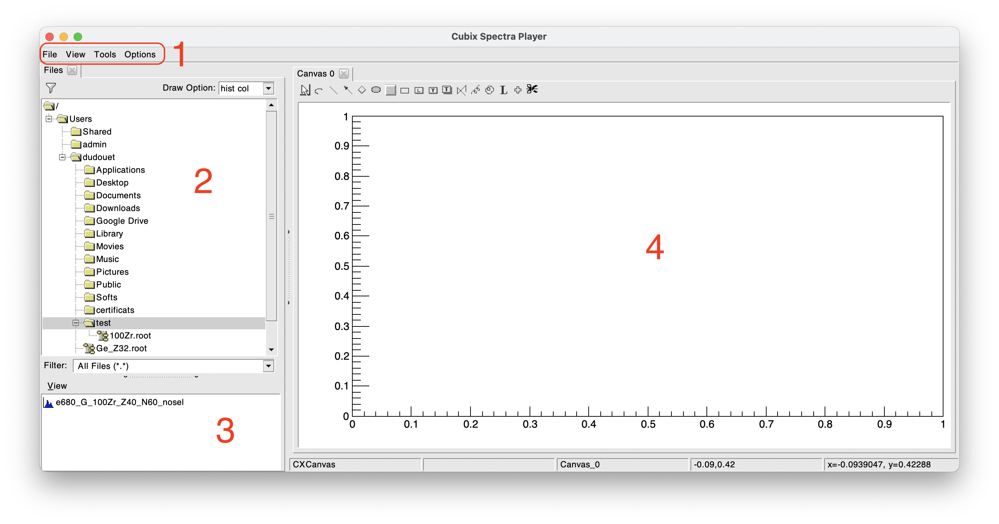
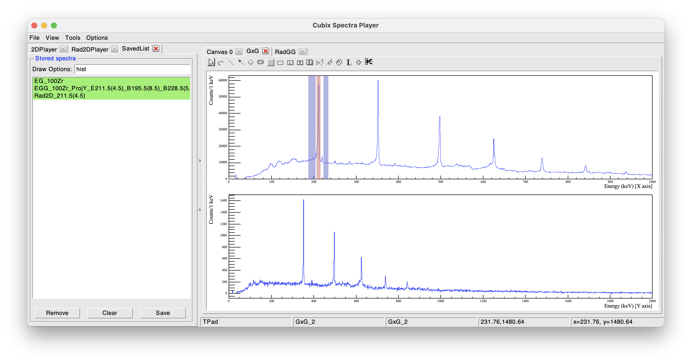

/** @page user-guide Cubix user guide

[TOC]

# The graphical interface

Cubix allows to make ɣ-ray spectroscopy analysis from histograms stored in ROOT files.

To start Cubix, simply use the command `cubix`

```
cubix
   ______        __     _       | Documentation: https://cubix.in2p3.fr/
  / ____/__  __ / /_   (_)_  __ |
 / /    / / / // __ \ / /| |/_/ | Source: https://gitlab.in2p3.fr/ip2i_gamma/cubix/cubix   
/ /___ / /_/ // /_/ // /_>  <   |
\____/ \____//_____//_//_/|_|   | Version 1.0

[==        ] Loading tkn db...
```

 The loading of the TkN database is launched in a separate thread. It is necessary to wait its full loading to use tools that are intereacting with nuclear databases (like the ENSDF reader or the nuclear chart).

&rarr; On standard computers, not compiled in Debug, it should takes around 10-15 seconds.

This will open the Cubix main window as bellow:



The Cubix main window is composed of different parts:

1. Menu bar
2. File browser
3. ROOT file browser
4. Spectra display

### The Menu Bar

The menu bar is composed of the following parts:

* <u>**The File menu:**</u>
  * **New Canvas**: add a new active canvas to the display part
  * **New Browser**: open a standard ROOT TBrowser
  * **Save Canvas as**: save the active canvas in the desired format (png, pdf...)
  * **Save hist to ASCII**: save the active histogram in an ASCII file 
* <u>**The View menu:**</u>
  * **Browse Files**: Open the file browser (part 2 on above picture)
  * **Saved list**: Open the histogram saved list (see bellow)
  * **Show editor**: Open the ROOT editor
* <u>**Tools:**</u> These elements are described in detail in the documentation
* <u>**Options:**</u>
  * **Show stats**: to display or not the spectra statistics
  * **Show Title**: to display or not the spectra titles

### The file browser

 By default, the left panel is dedicated to the file browser. It allows to navigate in your directories to find your favourite root file and open it (double click).

The file content will be displayed in the ROOT file browser (bottom left part). In this example, the ROOT file opened contains one 1D histogram and one 2D histogram (ɣ-ɣ matrix)

To display a spectrum, just double click on it.

### The saved list utility

During an analysis, it can be useful to save spectra, for being reused or for being saved on disk. Any spectrum can be added to this list (right click: Add to stored spectra). This is in particular useful when doing ɣ-ɣ analysis to save the different projections.

In the following example, we can see that 3 spectra have been added to the saved list. It is then possible to write these spectra on disk using the "Save" button



# The spectra player

## Plotting histograms

### Draw options

To plot an histogram, one just have to double click on it. It will be displayed using the "Draw Options" written on the top of panel 2.

The draw options are the standard one from ROOT, with few more possibilities

* **norm**: Normalize the histogram to a total area of 1

* **add**: add the histogram to the current one
  
  * **add(2)** will add the histogram with factor 2

* **div**: divide the histogram to the current one
  
  * **div(2)** will divide the histogram with factor 2

* **mult**: divide the histogram to the current one
  
  - **mult(2)** will divide the histogram with factor 2

The Draw options can be added: ex: "hist norm same" will draw the selected histogram, normalised, on the same pad than the current histogram

### Histogram manipulations

Histograms can be **cut/copy/paste** from one canvas to another one. Just right click on the histogram and select **cut/copy**, and then on another canvas, right click: **paste**

An histogram can be removed from the current pad without being deleted, for this use right click: **Undraw**

An histogram already plotted in the canvas can be normalized or scaled using right click: **Normalize/Scale**

### Zoom utilities

Some tools have been added to the standard ROOT possibilities. 

- With the ***Shift*** key staying pressed, a **click+slide** with the mouse will draw a box on the canvas. When releasing the mouse click, the x range of the box will be applied to the histogram

- With the ***Shift*** key pressed and a click on the canvas will make the range between zero and the clicked energy value

- With the ***Shift*** key pressed and a double click will unzoom the x axis

### Keyboard shortcuts

A large number of keyboard shortcuts are available.

 **There is one known issue with keyboard shortcuts. It a text zone has been clicked (like Draw Options, ENSDF nuclei...), instead of applying the keyboard shortcut, it will write the text in the text entry. This issue cannot be fixed. The only known solution for this is to switch to another window (like the terminal), and switch again on the Cubix window to recover the ability of using keyboard shortcut.**

<u>Find bellow the list of available shortcuts:</u>

| Key                        | Result                                                                     |
|:--------------------------:| -------------------------------------------------------------------------- |
| **CTRL+i**                 | **Print** the **shortcuts** info in the terminal                           |
|                            |                                                                            |
| **Histogram manipulation** |                                                                            |
| **CTRL+c**                 | **Copy** histogram under cursor                                            |
| **CTRL+x**                 | **Cut** histogram under cursor (copy and undraw)                           |
| **CTRL+v**                 | **Paste** the copied histogram in the current canvas (add to current ones) |
| **CTRL+d**                 | **Undraw** histogram under cursor                                          |
| **SHIFT+s**                | **Add** the spectrum under the cursor to the **saved list**                |
| **CTRL+n**                 | **Normalize** histogram under cursor in area                               |
| **CTRL+m**                 | **Normalize** histogram under cursor to the maximum                        |
| **SHIFT+wheel**            |                                                                            |
| **Canvas manipulation**    |                                                                            |
| **n**                      | Open a **new canvas**                                                      |
| **CTRL+g**                 | **set/unset grid** on X and Y axes                                         |
| **SHIFT+c**                | **set/unset CrossHair** (wheel click to measure distances)                 |
| **CTRL+u**                 | **Update** canvas                                                          |
| **F12**                    | **Unzoom**                                                                 |
| **F9**                     | **set/unset log** scale on **X axis**                                      |
| **F10**                    | **set/unset log** scale on **Y axis**                                      |
| **F11**                    | **set/unset log** scale on **Z axis**                                      |
| **Arrows**                 | **Move** on axis under cursor                                              |
|                            |                                                                            |
| **Peak utilities**         |                                                                            |
| **s**                      | **Peak search** (see Peak fitter section)                                  |
| **f**                      | Start a **new fit definition** (see Peak fitter section)                   |
| **CTRL+f**                 | **Perform the fit** for the selected peaks (or double click)               |
| **CTRL+a**                 | Start the **calibration utility**                                          |
| **c**                      | **Clear** current fits and peak search values                              |
| **r**                      | **Remove the arrow** (from peak search or ENSDF) under the cursor          |
|                            |                                                                            |
| **Gamma-Gamma mode**       |                                                                            |
| **g**                      | **Add a gate**                                                             |
| **g+g**                    | **Add a gate** (open a dialog to set energy and width)                     |
| **b**                      | **Add a background**                                                       |
| **b+b**                    | **Add a background** (open a dialog to set energy and width)               |
| **c**                      | **Clear** all gates and background                                         |
| **d**                      | **Remove** the gate under the cursor                                       |
| **p**                      | **Project**                                                                |
|                            |                                                                            |
|                            |                                                                            |

## 1D spectra utilities

### ENSDF reader

### Peak fitter

### Energy calibration

### Background player

## 2D spectra utilities

### ɣ-ɣ player

### ɣ-ɣ player (radware style)

## 3D spectra utilities

### ɣ-ɣ-ɣ player (radware style)

# Gamma search

# Nuclear Chart Player
